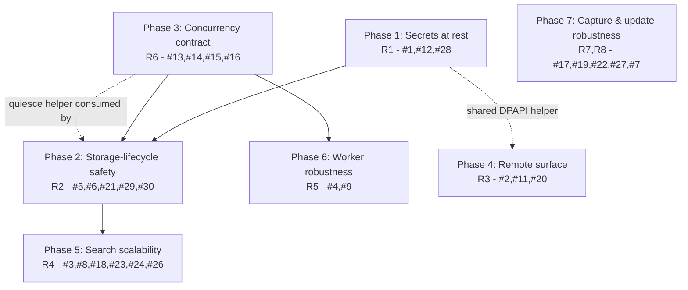

# fix: Production-readiness hardening (Clipthrough)

**Created:** 2026-06-10
**Type:** fix (cross-cutting hardening)
**Depth:** Deep
**Branch:** `fix/prod-hardening`
**Origin:** whole-repo `ce-code-review` (9 reviewer personas, 30 findings). Full artifacts in the main checkout at `artifacts/ce-code-review/20260610-100838-wholerepo/` (untracked); findings are restated inline below so this plan is self-contained.

---

## Summary

The review found Clipthrough is **not production-ready**: one P0 plus a cluster of P1 blockers around remote code execution, plaintext encryption-key storage, data-loss on storage-lifecycle operations, and search that OOMs on a large history. This plan sequences the fixes into 7 phases (one PR per phase), ordered by risk and dependency. Two scope decisions are already settled with the user: **drop the remote script/AI execution endpoints** entirely (eliminate the RCE surface rather than harden it), and **auto-migrate** existing plaintext DB keys to DPAPI on next launch (no user lockout).

The god-object refactor of `MainWindowViewModel` (finding #10) is **explicitly out of scope** as a standalone effort — it is addressed opportunistically where Phase 3 introduces the DB-access seam, not as a blocking rewrite.

---

## Problem Frame

Clipthrough is an Avalonia 11 / .NET desktop clipboard manager using encrypted SQLite (SQLCipher, WAL), with background embedding + OCR workers, AI transforms (GitHub Copilot auth), clipboard capture, an optional remote HTTP API, user scripting, legacy import, and auto-update. As a clipboard manager it persists everything the user copies — passwords, tokens, PII — so confidentiality of the store and of secrets at rest is the core security property, and data-loss/lockout on its storage-lifecycle operations is unacceptable.

The 30 findings concentrate in four areas, each a phase cluster: **secrets at rest**, **storage-lifecycle data-loss**, **SQLite concurrency**, and **remote/scripting attack surface**, plus **search scalability**, **worker robustness**, and **capture/update robustness**.

---

## Requirements

Traceability back to review findings (the `#N` IDs are the review's stable finding numbers).

- **R1 — Secrets never at rest in plaintext.** The DB encryption key and all credentials (AI API key, remote token, OAuth token) are protected via `IDataProtectionService`; existing plaintext keys auto-migrate without lockout. (#1, #12, #28)
- **R2 — Storage-lifecycle operations are crash-safe.** Rekey, encryption toggle, storage-path move, and backup/restore never lose data, never lock the user out of an intact DB, and quiesce workers + clear the connection pool around whole-DB operations. (#5, #6, #21, #29, #30)
- **R3 — No remote code execution; no sensitive-clip exfiltration.** The remote API exposes only read/capture (no script/AI execution); sensitive clips are withheld; non-loopback binds are refused without transport protection. (#2, #11; #20 reduced to a local-only concern)
- **R4 — Search/list scales to large histories.** Text scans never load image BLOBs; pagination is pushed into SQL; field coverage is consistent across paths; the semantic-cache read is race-free. (#3, #8, #18, #23, #24, #26)
- **R5 — Background workers are robust.** Persistent embedding failure idles instead of hot-looping; the embedding cache updates incrementally. (#4, #9)
- **R6 — SQLite concurrency contract holds.** `busy_timeout` is applied to every connection; contention is retryable (no shared-cache `SQLITE_LOCKED` footgun); no DB call runs on the UI thread. (#13, #14, #15, #16)
- **R7 — Capture pipeline never silently drops data.** Unexpected exceptions (notably `SqliteException`) are observed/surfaced; malformed/oversized payloads are handled. (#17, #19, #22, #27)
- **R8 — Auto-update integrity.** The update feed is HTTPS-pinned/allowlisted and package signatures are verified. (#7)
- **R9 — High-risk paths are tested.** Each phase lands tests for the behavior it changes; the review's named coverage gaps are closed. (review Coverage section)

**Out of scope (deferred to follow-up):** #10 god-object refactor of `MainWindowViewModel`/`App.axaml.cs` as a standalone effort; broad localization extraction (#P3 hardcoded strings); namespace-flatness cleanup of `Services/Search/`.

---

## Key Technical Decisions

- **KTD1 — Drop the remote script/AI transform kinds (not harden them).** The `POST /clips/{id}/transform` endpoint's `kind=script` (and `kind=ai`) route to unsandboxed Roslyn / third-party AI. Per user decision, remove those kinds from the remote surface entirely; the remote API keeps only read + capture behind the existing bearer token. This collapses the largest attack surface (#2) into a deletion rather than a TLS+sandbox+consent project, and reduces #20 (ScriptingService sandbox) to a local-only concern (still get a timeout/resource cap, but no longer a network-reachable RCE).
- **KTD2 — Auto-migrate plaintext keys to DPAPI on next launch.** On load, detect a plaintext `DatabasePassword`/credential in `storage.json`/`settings.json`, `Protect()` it, and rewrite the file. Seamless; no re-prompt. Mirror the existing working pattern in `CopilotAuthService` (`Protect`/`Unprotect`, drop on unprotect failure).
- **KTD3 — One DB-access offload + connection seam.** All SQLite connections open through `SqliteConnectionFactory` (so `busy_timeout` is universal, #14); all DB access from the UI thread is offloaded. Rather than re-litigate 26 call sites, the stragglers in `App.axaml.cs` and `MainWindowViewModel` are wrapped, and a thin `RunDbAsync` helper centralizes the convention so new call sites can't reintroduce the freeze (#15, partial #10).
- **KTD4 — Use SQLite private cache, not shared.** `SqliteConnectionFactory` sets `Cache=Shared`, which surfaces in-process contention as `SQLITE_LOCKED` — which `busy_timeout` does **not** retry. Switch to the default private cache so contention is `SQLITE_BUSY` (retried by the 5s `busy_timeout`). Validate under concurrent capture+embedding+OCR load. (#13)
- **KTD5 — Single "quiesce + ClearAllPools" helper for whole-DB operations.** Rekey, storage-path move, backup, and restore all rewrite/replace the DB file while workers hold pooled connections. Introduce one helper that stops `ClipboardMonitorService`/`BackgroundOcrQueue`/`EmbeddingWorker`, calls `SqliteConnection.ClearAllPools()`, runs the operation, verifies, then resumes — reused by every lifecycle op. (#6, #21, #29)

---

## High-Level Technical Design

Phase dependency and PR sequencing:

Rationale for order: **Phase 1 (secrets)** is the P0 and unblocks nothing else, so it ships first and fast. **Phase 3 (concurrency)** is foundational — KTD4/KTD5 helpers are consumed by Phase 2's lifecycle fixes and Phase 6's workers — so it lands before Phase 2. **Phase 4 (remote)** is independent (mostly deletion) and can run in parallel. **Phases 5–7** build on the stabilized concurrency base.

---

## Phased Delivery

One PR per phase; each PR is independently shippable and verifiable. Phases 1, 3, 4 have no inter-dependencies and may proceed in parallel by separate workers; 2, 5, 6, 7 depend on 1/3 as shown.

| Phase | Requirement | Units | PR theme |
|-------|-------------|-------|----------|
| 1 | R1 | U1–U3 | DPAPI for all secrets + auto-migration |
| 3 | R6 | U8–U9 | SQLite concurrency contract |
| 2 | R2 | U4–U7 | Storage-lifecycle crash-safety |
| 4 | R3 | U10–U11 | Remove remote RCE surface |
| 5 | R4 | U12–U15 | Search scalability |
| 6 | R5 | U16–U17 | Worker robustness |
| 7 | R7,R8 | U18–U21 | Capture + update robustness |

---

## Implementation Units

### Phase 1 — Secrets at rest (R1)

### U1. DPAPI-protect the DB encryption password + auto-migrate

- **Goal:** Stop persisting the SQLCipher master key in plaintext; transparently migrate existing plaintext keys. (#1)
- **Requirements:** R1
- **Dependencies:** none
- **Files:** `Clipthrough/Services/Storage/StorageOptionsService.cs`, `Clipthrough/Services/Security/IDataProtectionService.cs` (consume), `Clipthrough.Tests/Unit/StorageOptionsServiceTests.cs`
- **Approach:** In `SaveToDiskAsync`, `Protect()` the password before serialization (store a protected blob + a marker distinguishing protected vs legacy-plaintext). In the load path, if the field is legacy-plaintext, use it, then immediately re-save protected (auto-migration, KTD2). Drop the key on `Unprotect` failure (mirror `CopilotAuthService.TryLoadGitHubToken`). Remove the raw `DatabasePassword` string from the persisted document shape.
- **Patterns to follow:** `CopilotAuthService.TryPersistGitHubToken`/`TryLoadGitHubToken` (`Protect`/`Unprotect`, drop-on-failure).
- **Test scenarios:**
  - Save with remember=true → `storage.json` contains no plaintext password substring; round-trips to the original key in-session.
  - Load a legacy plaintext `storage.json` → opens DB successfully AND the file is rewritten protected (assert no plaintext on reload).
  - `Unprotect` failure (corrupt blob) → key dropped, app prompts for password, no crash.
  - remember=false → key usable in-session, never written.
- **Verification:** No plaintext key in `storage.json` after any save; existing users are not locked out after upgrade.

### U2. DPAPI-protect AI API key + remote API token

- **Goal:** Remove plaintext credentials from `settings.json`. (#12)
- **Requirements:** R1
- **Dependencies:** U1 (shared protect/migrate pattern)
- **Files:** `Clipthrough/Services/Storage/SettingsService.cs`, `Clipthrough/Models/AppSettings.cs`, `Clipthrough.Tests/Unit/...` (new `SettingsServiceSecretsTests.cs`)
- **Approach:** Persist `AiApiKey` and `RemoteApiToken` via `IDataProtectionService` (separate protected fields or a protected sidecar), not as plain serialized `AppSettings` strings. Auto-migrate legacy plaintext on load like U1.
- **Test scenarios:** save → no plaintext key/token in `settings.json`; legacy plaintext migrates on load; round-trip correctness.
- **Verification:** `settings.json` carries no readable credential.

### U3. Real secret protection on non-Windows (or in-memory only)

- **Goal:** Stop writing OAuth tokens through a no-op protector on non-Windows. (#28)
- **Requirements:** R1
- **Dependencies:** U1
- **Files:** `Clipthrough/Services/Platform/NoOpDataProtectionService.cs`, `Clipthrough/App.axaml.cs` (DI registration ~145), `Clipthrough/Services/Ai/CopilotAuthService.cs`
- **Approach:** Either implement a real non-Windows protector (libsecret/Keychain) OR, if out of near-term scope, change the contract so `CopilotAuthService` (and U1/U2 paths) keep secrets **in-memory only** when just a no-op protector is available rather than writing cleartext to disk. Decision recorded in Open Questions.
- **Test scenarios:** with a no-op protector, token is not persisted to disk (assert no token file written); with a real protector, round-trips.
- **Verification:** No cleartext secret on disk on any platform.

---

### Phase 3 — SQLite concurrency contract (R6) — *land before Phase 2*

### U8. Private cache + universal `busy_timeout` via the factory

- **Goal:** Make contention retryable and apply `busy_timeout` to every connection. (#13, #14)
- **Requirements:** R6
- **Dependencies:** none
- **Files:** `Clipthrough/Database/SqliteConnectionFactory.cs`, `Clipthrough/Services/Storage/StorageOptionsService.cs` (`OpenConnection`), `Clipthrough/Services/Storage/DatabaseBackupService.cs` (`CheckpointSafely`), `Clipthrough/Services/Storage/ClipAngelImportService.cs` (raw connections), `Clipthrough.Tests/Integration/ClipStoreServiceTests.cs` (or new concurrency test)
- **Approach:** Remove `Cache = SqliteCacheMode.Shared` (KTD4) — default private cache so contention is `SQLITE_BUSY`, which the existing 5s `busy_timeout` retries. Route every live-DB connection through `SqliteConnectionFactory.CreateConnection()` (or attach the same `StateChange` `busy_timeout` handler) so rekey/checkpoint/backup/startup-probe connections are covered (#14). Foreign-DB connections (legacy/temp import) may stay raw but should still get `busy_timeout` for consistency.
- **Execution note:** Start with a failing concurrency test (below) to prove the contract.
- **Test scenarios:**
  - Concurrency: `EmbeddingWorker`-style writes + parallel `CaptureAsync`/`SaveEmbeddingBatchAsync` over one DB via `Task.WhenAll` → all writes succeed, no `database is locked`/`database table is locked`, no hang. (Covers the shared-cache regression.)
  - Assert the `StateChange` handler issues `PRAGMA busy_timeout` on open for a factory connection.
  - Rekey/checkpoint connection opened under writer contention waits (does not immediately throw `SQLITE_BUSY`).
- **Verification:** No lock exceptions under concurrent worker + UI write load; every connection path applies `busy_timeout`.

### U9. Offload all UI-thread DB calls (hotkeys + settings save) + `RunDbAsync` seam

- **Goal:** No SQLite call blocks the UI thread. (#15, #16, partial #10)
- **Requirements:** R6
- **Dependencies:** none
- **Files:** `Clipthrough/App.axaml.cs` (hotkey handlers `CopyAndFavorite`/`CopyAndSensitive`/`PasteAndDelete`/`PasteAndFavorite`/`PasteAsPlainText`/`PasteAtOffset`/`ExecuteCustomHotkey`), `Clipthrough/ViewModels/MainWindowViewModel.cs` (`SaveSettingsAsync` ~6416, `PersistCurrentFilterStateAsync`, `Persist*InBackground`), a new small helper (e.g. `Clipthrough/Services/DbDispatch.cs` or a static `RunDbAsync`)
- **Approach:** Wrap each `_clipStoreService.*` (and `SaveAsync`) call in the hotkey handlers and the settings-save command in `Task.Run` (keep `CopyTextAsync`/`SimulatePasteKeystroke` on the UI thread). Introduce a thin `RunDbAsync(Func<Task>)` the call sites use, so the offload convention is centralized (KTD3) and new DB calls can't silently run on the UI thread. Fix the mis-named `Persist*InBackground` methods to actually offload.
- **Test scenarios:**
  - Headless: a hotkey-triggered write while a SQLite writer is busy keeps the dispatcher responsive (no UI-thread block).
  - `SaveSettingsAsync` with a DB-path change does the file copy off the UI thread.
- **Verification:** No `await _clipStoreService.*`/`SaveAsync` on the UI thread; dispatcher stays responsive under writer contention.

---

### Phase 2 — Storage-lifecycle crash-safety (R2)

### U4. Quiesce-workers + ClearAllPools helper

- **Goal:** One reusable guard that stops workers + clears the connection pool around whole-DB operations. (KTD5, supports #6/#21/#29)
- **Requirements:** R2
- **Dependencies:** U8 (private cache / factory)
- **Files:** new `Clipthrough/Services/Storage/DatabaseMaintenanceScope.cs` (or extend `StorageOptionsService`), consumers in `StorageOptionsService` + `DatabaseBackupService`; references existing quiesce logic in `MainWindowViewModel.RestoreBackupAsync` (~3213-3219)
- **Approach:** `IAsyncDisposable` scope: on enter, stop `ClipboardMonitorService`/`BackgroundOcrQueue`/`EmbeddingWorker` and `SqliteConnection.ClearAllPools()`; on exit, `ClearAllPools()` again and resume workers. Model on the existing `RestoreBackupAsync` quiesce sequence (which already does the stop but not the pool clear).
- **Test scenarios:** scope stops/resumes workers; pool cleared on enter and exit; exceptions inside the scope still resume workers (no permanent stop).
- **Verification:** No whole-DB op runs while workers hold pooled connections.

### U5. Atomic rekey + reject metadata-only password change

- **Goal:** Rekey can't lock the user out; same-path password edits actually re-encrypt. (#5, #6, #30)
- **Requirements:** R2
- **Dependencies:** U4
- **Files:** `Clipthrough/Services/Storage/StorageOptionsService.cs` (`RekeyAsync` ~188, `ApplyStorageChangesAsync` same-path branch ~143-146), `Clipthrough/Views/RekeyDialog.axaml.cs` (~73), `Clipthrough.Tests/Unit/StorageOptionsServiceTests.cs`
- **Approach:** Run rekey inside the U4 scope (workers stopped, pool cleared). Make rekey atomic: rekey a copy then swap, OR write a recovery record reconciled on next open, so a failure between `PRAGMA rekey` and persisting `storage.json` leaves the DB openable. Verify by reopening with the new key **before** persisting. For same-path password/encryption-toggle (`ApplyStorageChangesAsync` early-return), route through real re-encryption (`RekeyAsync`) instead of metadata-only write, or reject + steer to "Re-encrypt database…"; at minimum `CanOpenWithPassword(path, newPassword)` before writing.
- **Test scenarios:**
  - Single-quote password round-trips (`EscapeSqlLiteral` correctness).
  - Simulated `SaveToDisk` failure after `PRAGMA rekey` → DB still openable (no divergent in-memory vs on-disk key).
  - Same-path password change → file is actually re-encrypted (old key fails, new key opens); enabling encryption on a plaintext DB is reversible/openable.
  - remember=false rekey keeps key out of `storage.json` but usable in-session.
- **Verification:** No rekey/encryption-toggle path can leave an intact DB unopenable.

### U6. Atomic storage-path move (no pre-delete destroy, no worker race)

- **Goal:** Moving the DB path can't destroy an existing target or lose in-flight clips. (#29, #6)
- **Requirements:** R2
- **Dependencies:** U4
- **Files:** `Clipthrough/Services/Storage/StorageOptionsService.cs` (`ApplyStorageChangesAsync` ~150-159)
- **Approach:** Inside the U4 scope: copy source→temp beside `newPath`, then `File.Move(temp, newPath, overwrite: true)`; only then remove the old file. If `newPath` already exists, take a timestamped `.before-move` copy first. Never `File.Delete(newPath)` before the copy succeeds. Workers quiesced so no clip is written to the old path between snapshot and `Current` flip.
- **Test scenarios:**
  - Backup/copy throws mid-move → existing target file is preserved (pre-move backup intact), source intact.
  - Move succeeds → new path has all rows; old file removed.
  - (Integration) capture during move is not lost (written after resume to the new path).
- **Verification:** No path-move failure destroys data; no clips lost across the move.

### U7. WAL-complete backup + pool-safe restore

- **Goal:** Daily backup includes recent (WAL-resident) clips; restore can't leave a partial/locked swap. (#21)
- **Requirements:** R2
- **Dependencies:** U4
- **Files:** `Clipthrough/Services/Storage/DatabaseBackupService.cs` (`EnsureDailyBackupAsync` ~90 checkpoint, `RestoreAsync` ~159/186 file moves), `Clipthrough.Tests/Unit/` (new `DatabaseBackupServiceTests.cs`)
- **Approach:** Use `PRAGMA wal_checkpoint(TRUNCATE)` (like `TryCheckpointLegacyDatabase`) before `File.Copy`, or snapshot via the SQLite online-backup API / `VACUUM INTO`; or copy `-wal`/`-shm` alongside. Quiesce writers (U4) so a reader can't block the checkpoint. In `RestoreAsync`, run inside the U4 scope (pool cleared) before the `File.Move` sequence; validate the restored DB opens before declaring success.
- **Test scenarios:**
  - Backup taken with recent committed-but-WAL-resident clips → restored copy contains them.
  - `RestoreAsync`: restored content queryable; an unreadable backup leaves the original intact; throws on missing backup.
  - `PruneOldBackups` keeps exactly `DefaultRetention` newest.
- **Verification:** Backups are consistent and complete; restore never loses the live DB.

---

### Phase 4 — Remove remote RCE surface (R3)

### U10. Drop remote script/AI transform kinds + sensitive-clip withholding + bind guard

- **Goal:** Eliminate remote code execution and sensitive-data exfiltration from the remote API. (#2, #11; KTD1)
- **Requirements:** R3
- **Dependencies:** none
- **Files:** `Clipthrough/Services/Remote/RemoteControlService.cs` (`/transform` dispatch ~206-247, `ToDto`, `ResolveBindAddress` ~256, base URL ~312), `Clipthrough.Tests/` (new `RemoteControlServiceTests.cs`)
- **Approach:** Remove the `kind=script` and `kind=ai` branches from `/clips/{id}/transform` (keep only safe deterministic text transforms if any are non-AI, else drop `/transform` entirely). Withhold or redact `content` for `IsSensitive` clips in `/clips` and `/clips/{id}`. Refuse non-loopback binds unless transport protection is configured (or document loopback-only); require auth on `/openapi` and `/docs`; add auth-failure backoff. Keep the existing `FixedTimeEquals` bearer check.
- **Test scenarios:**
  - `POST /transform kind=script` → 404/400 (endpoint/kind removed), never executes.
  - `/clips` and `/clips/{id}` → sensitive clips return redacted/withheld content.
  - 401 on missing/empty/malformed/wrong bearer for every `/clips*` route; 200 with correct token.
  - `ResolveBindAddress` maps null/localhost/`*`/`0.0.0.0`/IP/garbage correctly; non-loopback refused without transport config.
- **Verification:** No network-reachable code execution; no sensitive content over the API.

### U11. Local ScriptingService timeout + resource cap

- **Goal:** The remaining local scripting feature can't hang the app or run unbounded. (#20, now local-only)
- **Requirements:** R3
- **Dependencies:** U10 (no longer network-reachable)
- **Files:** `Clipthrough/Services/Ai/ScriptingService.cs` (~54), `Clipthrough.Tests/Unit/ScriptingServiceTests.cs`
- **Approach:** Run scripts with a hard wall-clock timeout (watchdog) and bounded resources; cooperative cancellation alone is insufficient for `while(true)`. Optionally restrict references so `System.IO`/`Process`/reflection aren't implicitly available. Fix the existing weak `caches_compiled_script` test to assert caching/eviction behaviorally.
- **Test scenarios:** non-terminating script is killed at the timeout; allocation-heavy script is bounded; cache hit + eviction past `MaxCachedScripts` asserted behaviorally.
- **Verification:** A runaway local script cannot wedge the app.

---

### Phase 5 — Search scalability (R4)

### U12. Split read model: omit image BLOBs from list/search scans

- **Goal:** Stop loading `content_bytes`/`source_app_icon` for list/search; fetch full bytes only on demand. (#3, #8)
- **Requirements:** R4
- **Dependencies:** U8
- **Files:** `Clipthrough/Services/Storage/ClipStoreService.cs` (`ClipSelectColumns` ~22-51, `SearchInMemoryAsync` ~1105-1120, list/page query, `ReadClip`), `Clipthrough/Models/ClipEntry.cs` (or a new lightweight list DTO), `Clipthrough/ViewModels/ClipItemViewModel.cs` (lazy full-bytes fetch), `Clipthrough.Tests/Integration/ClipStoreServiceTests.cs`
- **Approach:** Introduce a metadata/thumbnail read model (small thumbnail blob + dimensions, no full `content_bytes`) for list + search; fetch full bytes by id only on select/open/edit. In `SearchInMemoryAsync`, never `SELECT content_bytes` for a text-only scan; push `LIMIT`/`OFFSET` into SQL for short terms and stream text columns only, stopping after `Offset+Limit` matches. Consider a downscaled thumbnail blob generated at capture.
- **Test scenarios:**
  - Search over a seeded large set (10k+) with image clips → does not materialize image BLOBs (assert via query shape / memory bound); returns correct page.
  - List/page query selects no `content_bytes`; opening a clip lazily loads full bytes.
- **Verification:** Search/list memory is bounded by metadata, not the image corpus.

### U13. Hoist per-clip Regex + unify field coverage across search paths

- **Goal:** One Regex per search; OCR/title/URL searchable in all paths. (#18, #24)
- **Requirements:** R4
- **Dependencies:** U12
- **Files:** `Clipthrough/Services/Storage/ClipStoreService.cs` (`MatchesSearch` ~1158-1191, `IsRegexMatch` ~1727, `BuildFtsExpression` ~1300)
- **Approach:** Build wildcard/whole-word `Regex` once per search (like the `UseRegex` branch), not per clip. Make in-memory/regex paths cover the same 5 columns as FTS (`content`, `source_app`, `source_window_title`, `source_url`, `ocr_text`). Reconcile the `<3-char` token rule so FTS and in-memory return consistent sets.
- **Test scenarios:** the three search paths return the same field-matched set (OCR text / window-title / URL survive toggling case-sensitive/regex); no per-row Regex build (one build per search).
- **Verification:** Consistent results across paths; no O(n) Regex builds.

### U14. Gate the semantic-cache read race

- **Goal:** `QueryAsync` can't read a torn `(ids,vectors,count,dim)` snapshot. (#23)
- **Requirements:** R4
- **Dependencies:** none
- **Files:** `Clipthrough/Services/Search/SemanticSearchService.cs` (~89-93, ~134-146)
- **Approach:** Publish the cache as a single immutable record reference swapped atomically in `RefreshCacheAsync`; `QueryAsync` captures that one reference (and `count`/`dim` from it) once. Removes `IndexOutOfRange`/phantom-row hazards.
- **Test scenarios:** concurrency test running `QueryAsync` against `RefreshCacheAsync` with changing cache sizes → no `IndexOutOfRange`, no phantom rows, scores consistent.
- **Verification:** Semantic query is race-free under concurrent refresh.

### U15. Debounce coverage/maintenance/OCR-refresh storms

- **Goal:** Stop per-batch/per-completion full-table work. (#26)
- **Requirements:** R4
- **Dependencies:** U8
- **Files:** `Clipthrough/Services/Storage/ClipStoreService.cs` (`GetEmbeddingCoverageAsync` ~1941, `TotalMatchingCount`/`ExecuteCountAsync` ~285, `ApplyMaintenanceAsync` ~660), `Clipthrough/App.axaml.cs` (~101 cache refresh), `Clipthrough/ViewModels/MainWindowViewModel.cs` (`OcrCompleted` ~476)
- **Approach:** Debounce coverage refreshes (per N seconds / on drain) instead of per `BatchCompleted`/`QueueChanged`; throttle `OcrCompleted`→refresh like `UpdatedClips` (250ms) or update only the affected row in place; approximate/cap `TotalMatchingCount` (e.g. `Limit+1` has-more) instead of a full COUNT per keystroke; gate `ApplyMaintenanceAsync` full scans behind threshold-crossing triggers.
- **Test scenarios:** N rapid batch/queue/OCR events collapse to bounded refreshes; search no longer runs a second full predicate per keystroke.
- **Verification:** Backfill/OCR storms don't drive thousands of full scans.

---

### Phase 6 — Worker robustness (R5)

### U16. Stop the embedding inference-failure hot-loop

- **Goal:** Persistent embedding failure idles instead of pinning a CPU core + starving the writer. (#4)
- **Requirements:** R5
- **Dependencies:** U8
- **Files:** `Clipthrough/Services/Search/EmbeddingWorker.cs` (`ProcessOnceAsync` ~139-153, `RunAsync` ~101), `Clipthrough/Services/Storage/ClipStoreService.cs` (`ClaimPendingEmbeddingsAsync` ~1791, `SetEmbeddingFailureAsync` ~1893), `Clipthrough.Tests/Integration/EmbeddingWorkerTests.cs`
- **Approach:** On the inference-failure path, return 0 (so `RunAsync` enters the idle `_wake.WaitAsync`) instead of `candidates.Count`; and/or stop treating `'failed'` as immediately re-claimable (add an attempt counter / next-retry-at so failed clips back off). Break the loop / guard when the ONNX model is missing (`FileNotFoundException` from `EnsureLoaded`); don't start the worker without a model-presence check.
- **Execution note:** Add the failing test first (the existing suite covers persist-failure but not inference-failure).
- **Test scenarios:**
  - `EmbedBatchAsync` throws persistently (e.g. missing model) → worker idles (no tight re-claim of the same failed batch); CPU not pinned; failed clips backed off, not re-failed every loop.
  - Vector-count mismatch → batch skipped, rows remain claimable, no save.
  - Claim throws → returns 0 and idles.
- **Verification:** A missing/corrupt model or poison clip does not spin the worker or starve the writer.

### U17. Incremental embedding cache (no per-batch full reload)

- **Goal:** Backfill is O(n), not O(n²). (#9)
- **Requirements:** R5
- **Dependencies:** U16
- **Files:** `Clipthrough/App.axaml.cs` (~100-101 `RefreshCacheAsync` per batch), `Clipthrough/Services/Search/SemanticSearchService.cs` (`RefreshCacheAsync`, append path)
- **Approach:** Make the cache incremental — append the new `(id, vector)` pairs from `BatchCompleted` instead of reloading all embeddings each 32-clip batch; or debounce to a single load on backlog-drain. Coordinate with U14's immutable-snapshot publish.
- **Test scenarios:** processing M batches loads embeddings O(M) times → assert incremental append (one full load at most, or none after warm); semantic results still correct after incremental updates.
- **Verification:** Large backfill does not re-read the whole embedding table per batch.

---

### Phase 7 — Capture & update robustness (R7, R8)

### U18. Surface silent capture/enrich/edit failures

- **Goal:** Unexpected exceptions (notably `SqliteException`) are observed and surfaced, not swallowed. (#17, #27)
- **Requirements:** R7
- **Dependencies:** none
- **Files:** `Clipthrough/Services/Capture/ClipboardMonitorService.cs` (`HandleClipboardChanged` catches ~207, `EnrichCapturedClipAsync` filtered catch ~413), `Clipthrough/ViewModels/MainWindowViewModel.cs` (`CommitEditedClipOnSelectionChangeAsync` ~4557, semantic/coverage `catch{}` ~3430/4447/4493), optionally a `TaskScheduler.UnobservedTaskException` handler in `Program.cs`
- **Approach:** Add a trailing `catch (Exception ex)` that traces (and ideally surfaces a notification / flags the clip) on the capture and enrichment paths; broaden the fire-and-forget `EnrichCapturedClipAsync` filter; wrap the edit-commit write in try/catch with `ReportError`. Replace bare `catch{ return ftsResult; }` with traced degradation. Register an `UnobservedTaskException` handler so discarded-Task faults are logged.
- **Test scenarios:** simulated `SqliteException` on the capture write → traced/surfaced, not silently dropped; deferred sensitivity scan that hits a transient lock re-queues / flags rather than leaving a sensitive clip unflagged.
- **Verification:** No capture/edit failure is invisible; degraded search is logged.

### U19. Bound malformed/oversized clipboard payloads

- **Goal:** Hostile/oversized RTF/HTML/image can't silently abort capture or hang the UI. (#22)
- **Requirements:** R7
- **Dependencies:** none
- **Files:** `Clipthrough/Presentation/ClipboardMarkupDecoder.cs` (`GetHeaderOffset` `int.Parse` ~148), `Clipthrough/Controls/RichWebContentView.cs` (RTF convert on UI thread ~243)
- **Approach:** Replace `int.Parse` with `long.TryParse` + clamp to `[0, html.Length]`, return null on failure (fall back to existing heuristics) so a 10-digit CF_HTML offset can't throw `OverflowException` and abort capture. Run `RtfToHtmlConverter.Convert` off the UI thread with size/time guards; cap live-render RTF size; fall back to plain text on timeout.
- **Test scenarios:** CF_HTML with `StartHTML/EndHTML` > Int32.Max → capture still succeeds (no overflow); oversized/pathological RTF render does not block the UI thread.
- **Verification:** Malformed payloads degrade gracefully; no capture suppression or UI hang.

### U20. Bound + secure ClipAngel import

- **Goal:** A hostile import file can't OOM, leak plaintext, or partially import. (#19)
- **Requirements:** R7
- **Dependencies:** U8
- **Files:** `Clipthrough/Services/Storage/ClipAngelImportService.cs` (`DecryptToTempAsync` ~314/343, `BuildCaptureRequest` blob read ~186, batch commits ~152/164)
- **Approach:** Cap source-file and decrypted-DB size; stream-decrypt page-by-page instead of `new byte[fs.Length]`; check blob length before `GetValue`; wrap the import in one owning transaction (or make it resumable) so a mid-import failure leaves no partial library; avoid a fully-decrypted on-disk temp (in-memory or restrictive-ACL + delete-on-close), since the current `%TEMP%` plaintext copy with best-effort cleanup leaks PII.
- **Test scenarios:** oversized file / oversized single blob → bounded memory + graceful rejection; mid-import failure → no partial rows committed; temp decrypted file removed after failed/cancelled import.
- **Verification:** Import is memory-bounded, transactional, and leaves no plaintext temp.

### U21. Auto-update feed integrity

- **Goal:** Update can't be hijacked via an overridable feed. (#7)
- **Requirements:** R8
- **Dependencies:** none
- **Files:** `Clipthrough/Services/System/UpdateService.cs` (`ResolveFeedUrl` ~163, `NormalizeFeedUrl`, `new UpdateManager(new SimpleWebSource(...))` ~49)
- **Approach:** Enforce `https://` + an allowlisted host in `NormalizeFeedUrl` so neither `CLIPTHROUGH_UPDATE_FEED` nor `UpdateFeedUrl` can point at an arbitrary http origin; do not let the env var outrank the configured feed in production. **Verify** Velopack package-signature verification is configured (embedded public key) before `ApplyUpdatesAndRestart`; if not, add it.
- **Test scenarios:** feed set to `http://...` or a non-allowlisted host (via settings or env) → rejected; positive bypass-outcome assertions replacing the existing weak negative-string `ManualCheck` test; apply-path returns false when not Velopack-installed / no feed.
- **Verification:** Updates only install from a trusted, signed, HTTPS source.

---

## Risks & Mitigations

- **Auto-migration data-lockout (U1):** a bug in detect/migrate could lock users out. Mitigation: migrate non-destructively (write protected, verify reopen, only then drop plaintext); keep a one-release fallback that still reads legacy plaintext.
- **Concurrency regression (U8 private cache):** changing cache mode could alter locking behavior subtly. Mitigation: the new concurrency integration test is the gate; validate under real capture+embedding+OCR load before merge.
- **Storage-lifecycle changes touch the user's only DB (Phase 2):** every op must be tested against an intact seeded DB with the U4 quiesce in place; never operate on a live, worker-attached file.
- **Search read-model split (U12) ripples into XAML bindings:** `ClipItemViewModel`/`ClipEntry` are bound directly (finding #10/maintainability). Mitigation: introduce the lightweight DTO behind the existing VM surface; lazy-load full bytes on select to avoid breaking the preview pane.

---

## System-Wide Impact

- **Existing users:** U1/U2 migrate their stored secrets on first launch of the new build — must be seamless (no re-prompt) and reversible-readable for one release.
- **Remote API consumers:** U10 removes `kind=script`/`kind=ai` — a breaking change for anyone scripting via the API. Acceptable per KTD1 (security); note in release notes.
- **Performance posture:** Phase 5 changes the read model — verify the preview/open paths still load full images correctly after the split.

---

## Verification Strategy (R9)

Per-phase, land the tests named in each unit. The review's explicit coverage gaps to close: RemoteControlService auth/bind (U10), `DeduplicateClipsByHashAsync` destructive upgrade (add a duplicate-hash migration test — separate small unit if needed), rekey failure-ordering + `CanOpenWithPassword`/`RequiresPassword` (U5), real `BackgroundOcrQueue` failure isolation, `DatabaseBackupService` restore/prune (U7), `SensitivityService` 8 detection regexes, SQLite writer-contention (U8), `EmbeddingWorker` inference-failure branch (U16). Replace weak tests: `ScriptingServiceTests` "caches" (U11), `UpdateService` ManualCheck (U21), `AppSettingsTests` default-pinning.

**Windows build constraint (per `.github/copilot-instructions.md`):** kill the running `Clipthrough.exe` before rebuilding (it locks its own DLL); if `MSB3492`/`obj` lock errors appear, remove `Clipthrough.Tests/obj` and rebuild. Each phase's worker should build + run only the tests it added/changed.

---

## Open Questions

- **U3 non-Windows protection:** implement a real libsecret/Keychain protector now, or switch to in-memory-only secrets when no real protector is available? (Default: in-memory-only — smaller, closes the cleartext gap; real protector as follow-up.)
- **U7 backup mechanism:** `wal_checkpoint(TRUNCATE)` + copy vs SQLite online-backup API / `VACUUM INTO`? (Resolve at implementation against the bundled SQLCipher's capabilities.)
- **U10 `/transform`:** are there any non-AI, deterministic transform kinds worth keeping on the remote surface, or remove `/transform` wholesale? (Default: remove wholesale unless a safe kind exists.)
